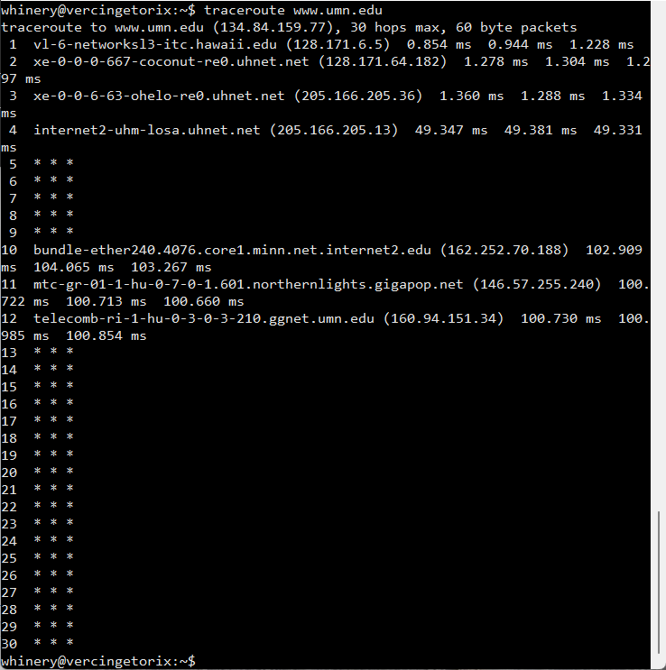

# Groundwork

# Take This Away -- (if nothing else)

Many people \(among them\, Sean and I\) are employed specifically to answer your questions and to help you move data effectively\.

We are interested in hearing about your experience\, any problem you may be having\, or discussing whether your data transfer solutions are meeting your needs

Expect _hundreds of Megabits per second_ of file transfer speed\. If you're not getting that\, ask us why not\.

Making data transfers perform well can be somewhat deep andcomplicated\, but it's _not mysterious_

> ## (Pretty Much All) Retail Marketing Is Gibberish
> * Buying a "faster" cable will not make your "streaming Internet" go faster
>   * Cat6 is only capable of 4 times throughput over Cat5e (10G vs 2.5G)
>   * This is an Ethernet cable, not an Audio/Video "streaming" cable
> * Making the "10x" claim conflicts with the "speeds up to 1Gbps" claim.

# How Stuff Connects Together

* Interfacility, Intercity, International links are glass optical fiber
  * Fiber follows market-size, OR geographical advantage (like Hawaii or Guam)
* Residential includes "fiber to the curb", but also TV Cable/DOCSIS
* Copper and WiFi in campuses and residences
* Mobile - LTE, further Gs
  * For the vast majority of people on the planet, "the Internet" looks like a smart phone
  * Particularly in markets where wired services were underdeveloped around Y2K
* Satellite is typically "last-hop"
  * role on continents has been limited
  * VSAT is still a major influence in the Pacific, and in places without fiber
  * O3B - Satellite for unserved populations
  * Starlink (wait for it…)
* Physical cables usually contain more than one logical "link"
  * Different colors of lasers operate together in the same glass fiber
  * Different virtual lans operate in the same Ethernet trunk

# UH Networking

* University of Hawaii System Network (uhnet)
  * Interconnects 10 instructional campuses and about 40 other facilities across the 6 public, populated islands in the State of Hawaii
  * Maintains "commodity" (general purpose) connectivity for "regular" Internet
    * CENIC commodity on dual-purpose 100G link to CENIC
    * I2PX quasi-commodity on dual-purpose 100 G link to Internet2
    * 10Gbps Hurricane Electric, via DR Fortress Honolulu
  * Maintains several REN (research and education network) connections
    * Oahu: Internet2, CENIC, AARNET, REANNZ, WRN
    * Hawaii Island: AARNET
* UH Operates the Hawaii Internet eXchange to keep local traffic local
* UH operates GOREX (Guam Open Research and Education eXchange)
* Peers with DR Fortress exchange in Honolulu

# The Several Internets

* Commodity
  * Commercial
  * residential
  * Et cetera - things not reached by research and ed networks (RENs)
* REN
  * Special networks which interconnect research and ed community resources together
  * Usually at increased performance
  * Regionals connect to national RENs (NRENs)
  * NRENs connect to each other
* Exchanges
  * Most often built as a place wheredifferentnetworks within a region can interconnect, so that their traffic doesn't take the long way around

## Commodity

## REN Path

