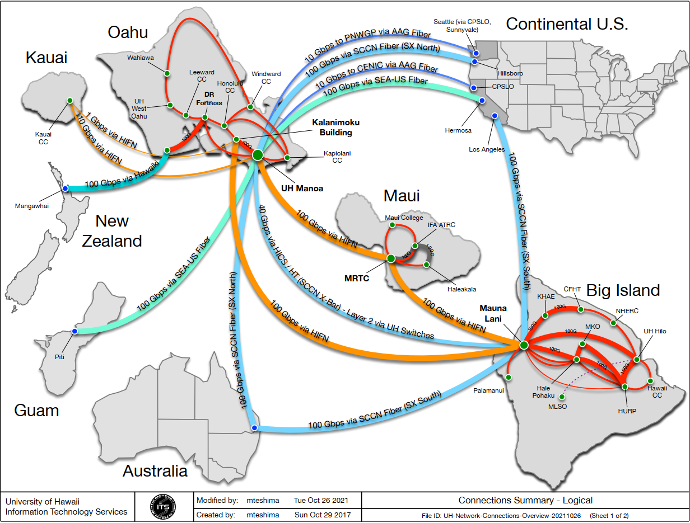
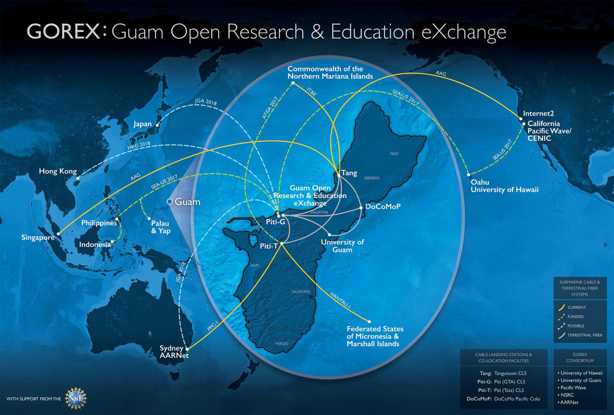
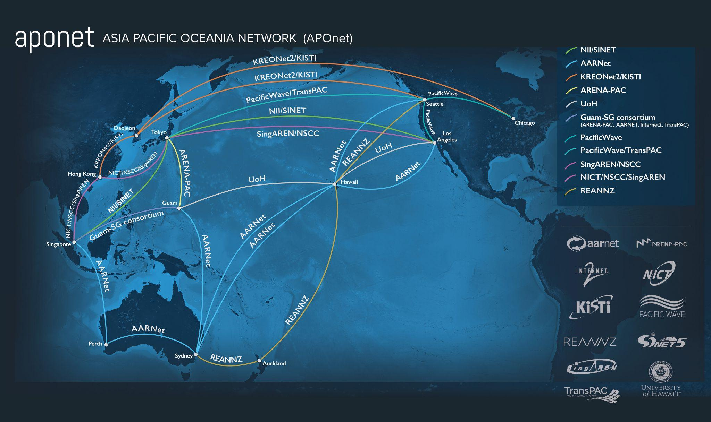
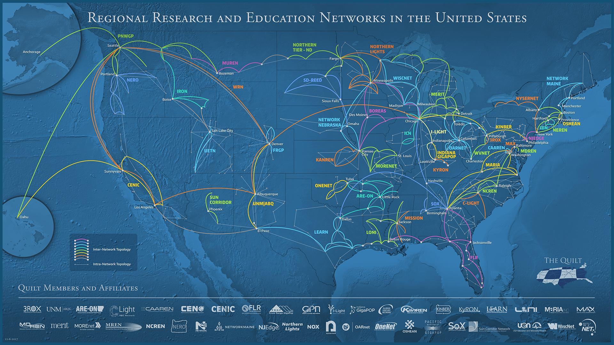
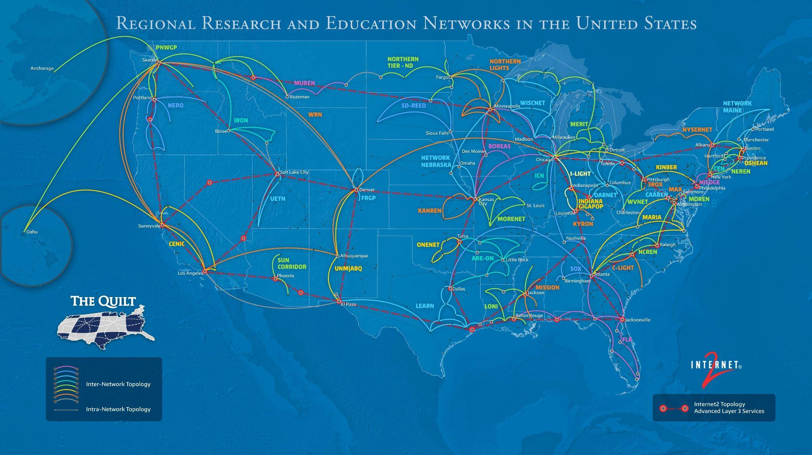
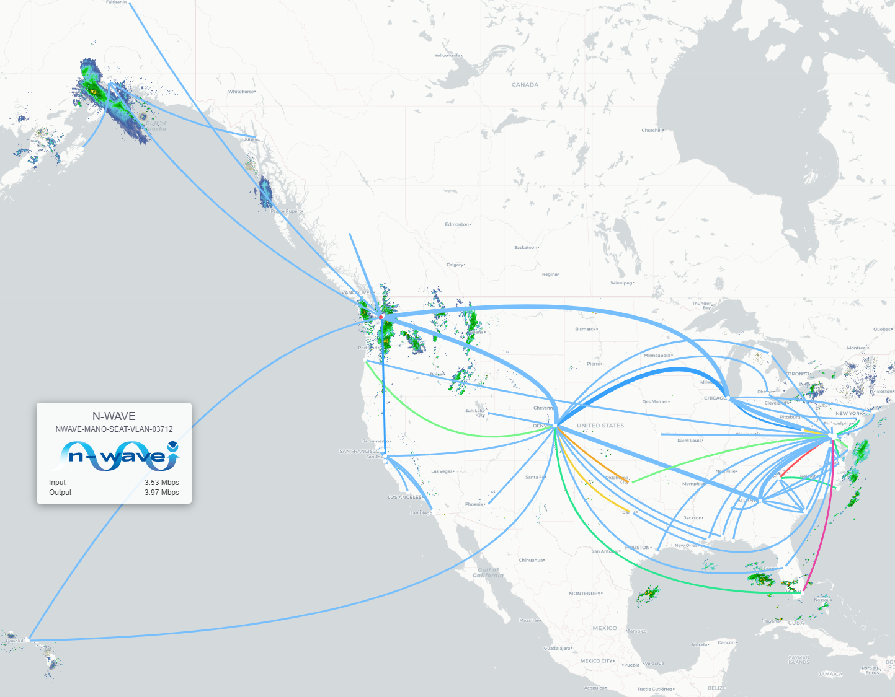
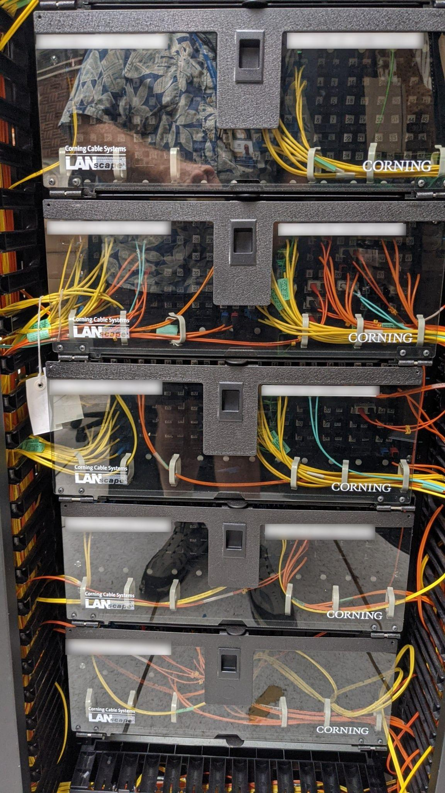
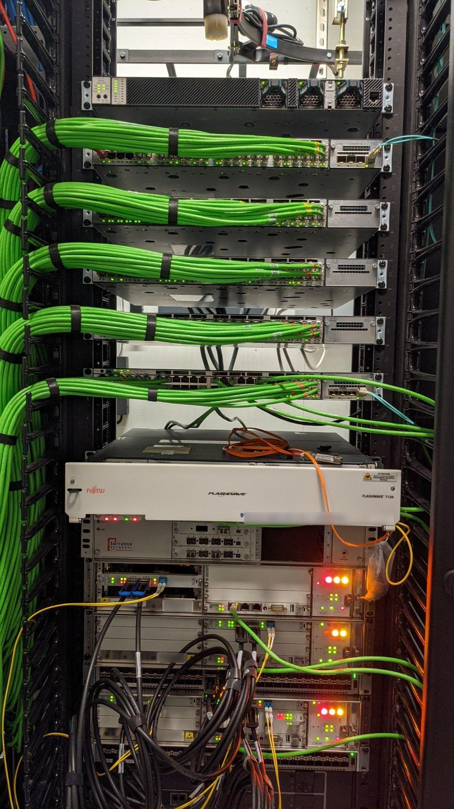
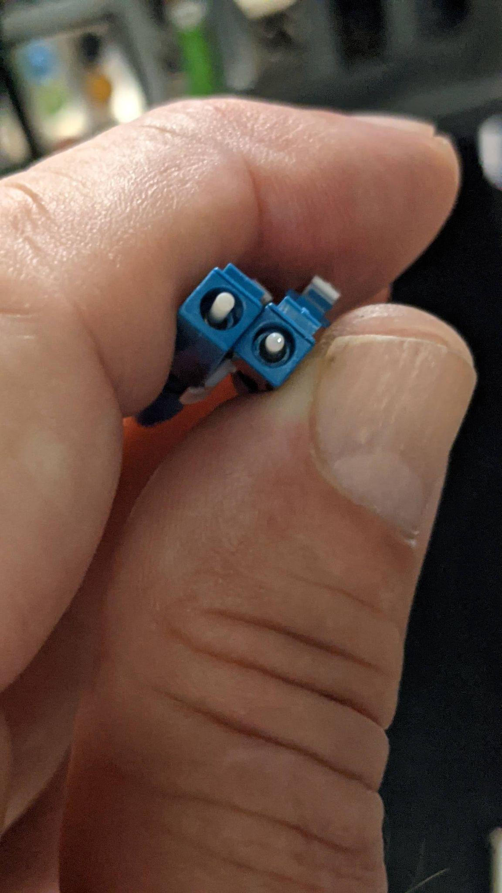
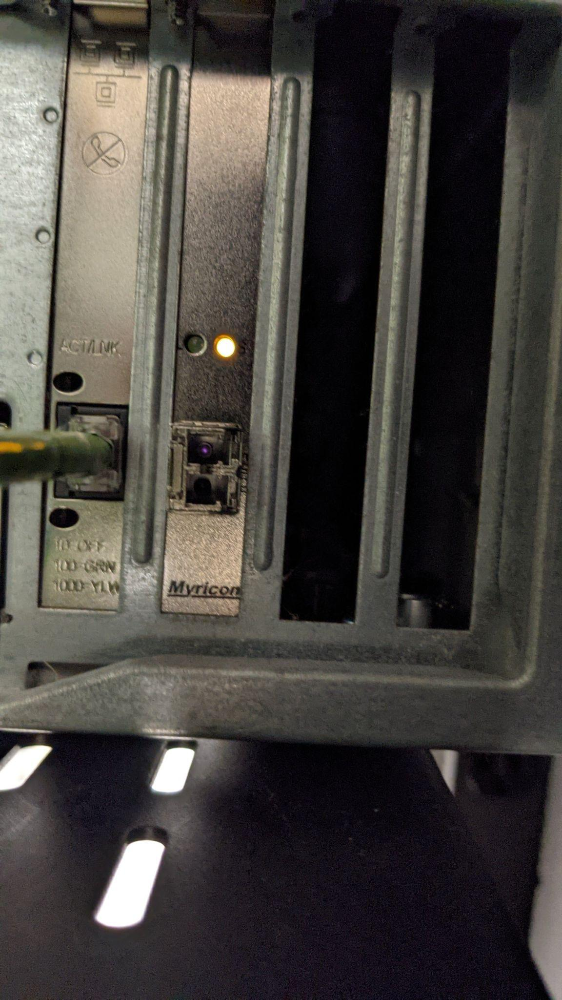

# Pictures Of Actual Networks

### U. Hawaii inter-island and REN peer connectivity

### Guam Open Research and Education eXchange

### APONet: collaboration of Pacific and Pacific Rim Networks

### Quilt diagram of US regional research and education networks

### The same Quilt map with Internet2 links added

### NOAA NWave

### US Department of Energy ESNet

### Medium scale Juniper router, capable of supporting 10Gbps and 100Gbps interfaces for long distance links

###Fiber distribution in data center

### Copper distribution in data center

### A pair of glass fiber LC connectors, and the 10Gbps Ethernet card which connects to the fiber.

### The infrared laser that transmits over the fiber is visible in the upper connector. The light is visible to my phone camera, but not to the naked eye.


