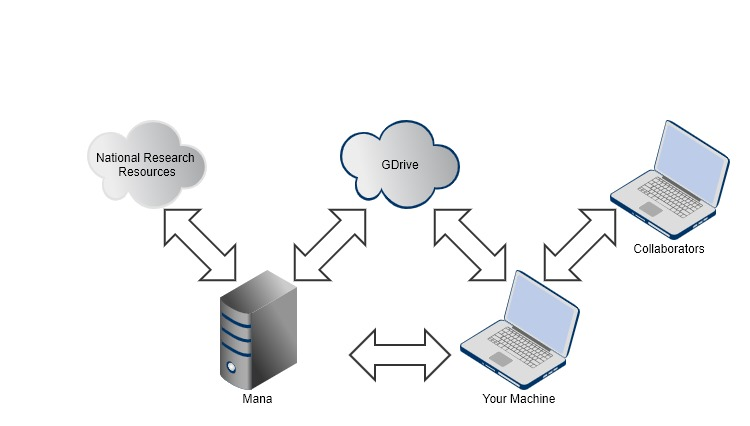

# Purpose of Globus 

Globus can use several different systems to move data
'Laptop? HPC cluster? Cloud storage? Tape archive? Access them all using just a web browser.

Data stored at a different institution? At a supercomputing facility? All you need is your campus login'

Globus is a service that makes it easy to move, sync, and share large amounts of data.

Globus will manage file transfers, monitor performance, retry failures, recover from faults automatically when possible, and report the status of your data transfer.

# Background

Globus uses GridFTP for more reliable and high-performance file transfer, and will queue file transfers to be performed asynchronously in the background.

Globus was developed and is maintained at the University of Chicago and is used extensively at supercomputer centers and major research facilities. https://globus.org

# When To use Globus

To transfer or share data between two Globus managed endpoints \(e\.g\. two multi\-user systems at different universities\, each running a Globus server\)

To transfer data between a managed endpoint \(e\.g\. UH\-HPC\) to a Globus Connect Personal endpoint \(e\.g\. your desktop\)

# ### Globus Plus
- For certain types of data transfer or sharing, you will need Globus Plus, the UH Globus subscription includes Globus Plus services, but you need to request a globus plus invite
- These scenarious include:
-   1.)   to share data from your Globus Connect Personal endpoint (eg. sharing data from your desktop)
-   2.)   data transfer between 2 Globus Connect Personal endpoints (eg. sharing data between your desktop and laptop)
-   3.)   to transfer data from a Globus Connect Personal endpoint
