# Transferring Data from and to Mana Using Globus Connect Personal

# The File Manager
After you’ve signed up and logged in to Globus, you’ll begin at the File Manager.

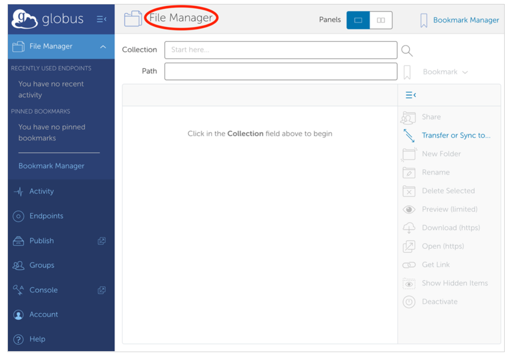
---

The first time you use the File Manager, all fields will be blank.

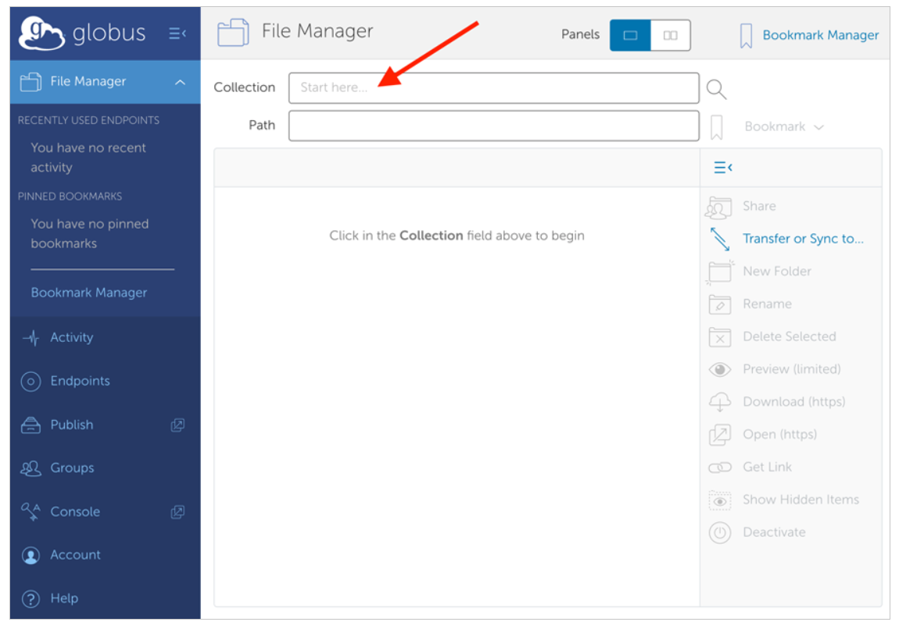

 __Tip__ 

 __Key Concept:__    _Collection_ 

A collection is a named location containing data you can access with Globus\. Collections can be hosted on many different kinds of systems\, including campus storage\, HPC clusters\, laptops\,   _Amazon S3 buckets\, Google Drive_    _\(these are_    _“premium” connectors so seperate subscription is required\)_   \, and scientific instruments\.

When you use Globus\, you don’t need to know a physical location or details about storage\. You only need a collection name\. A collection allows authorized Globus users to browse and transfer files\. Collections can also be used for sharing data with others and for enabling discovery by other Globus users\.   _[Globus Connect](https://www.globus.org/globus-connect)_   is used to host collections\.

# Access a collection

Click in the Collection field at the top of the File Manager page and type ”UH\-HPC"\. Globus will list collections with matching names\. Choose UH\-HPC\.

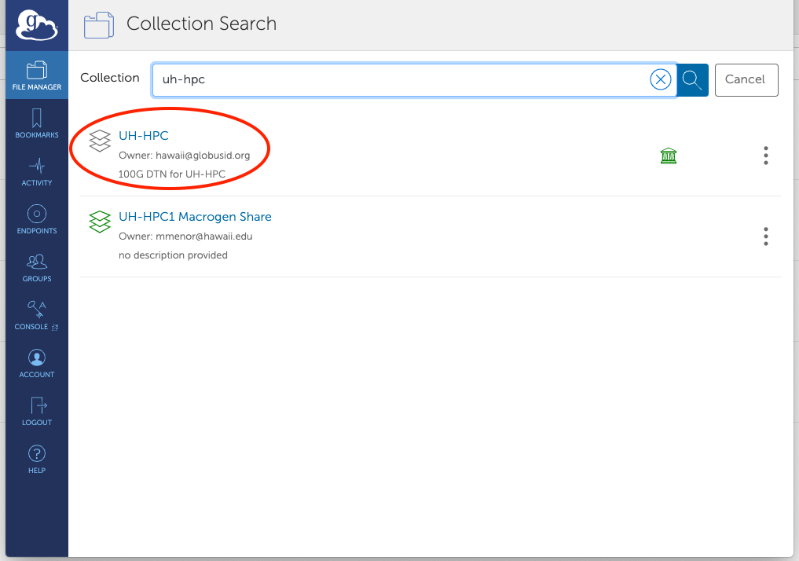

--- 

Globus will connect to the UH-HPC collection and display the default directory, /~/.  This is your home directory in the Mana Globus endpoint. Click on “Transfer or Sync to”.

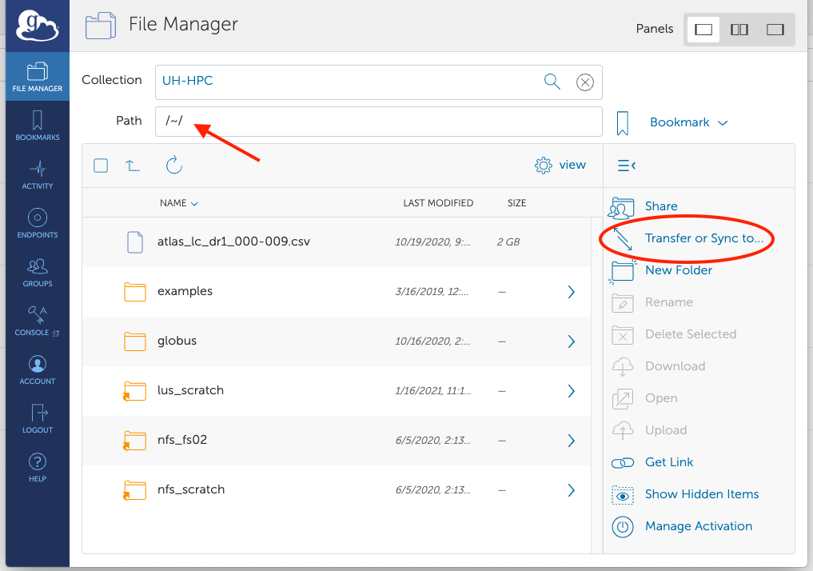

---

# Request a file transfer

A new collection panel will open\, with a ”Search" field at the top of the panel\. Click on it\.

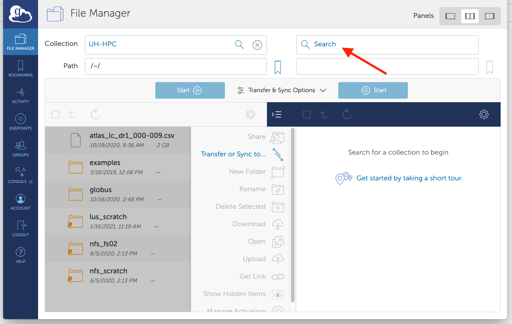

Click on “Your Collection” tab. Find the Globus Connect Personal endpoint you created earlier and click on it.

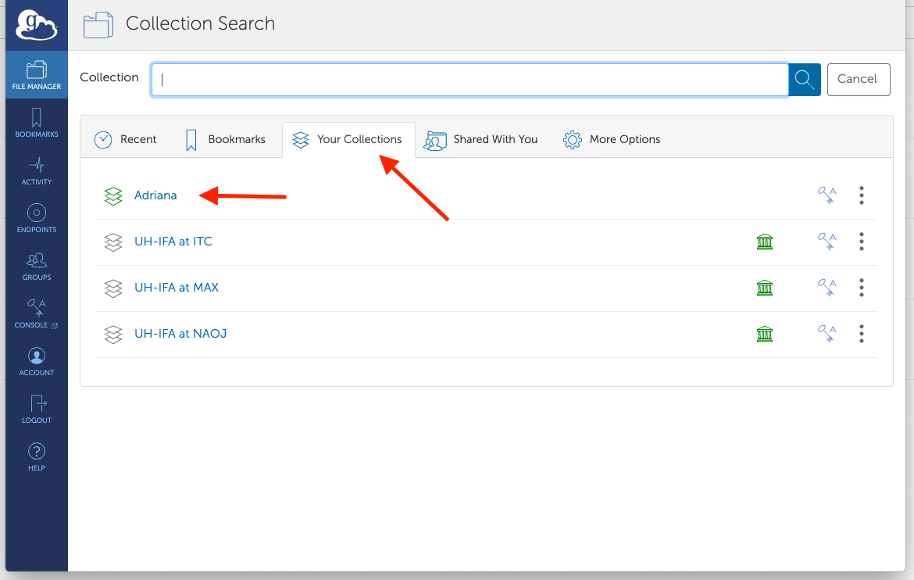

On the left collection, UH-HPC, select the file you would like to transfer. The Start> button at the top of the panel will activate. Click the Start> button to transfer the selected files to the collection in the right panel.

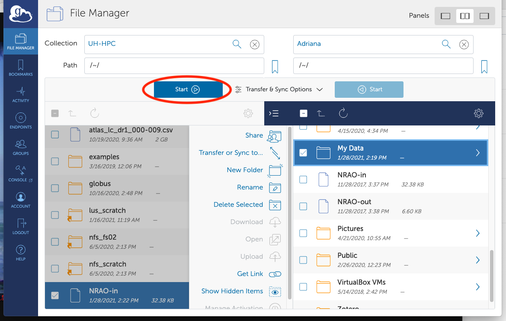

---

Globus will display a green notification panel—​confirming that the transfer request was submitted—​and add a badge to the “Activity” item in the command menu on the left of the page. Click Activity in the command menu on the left of the page to go to the Activity page.

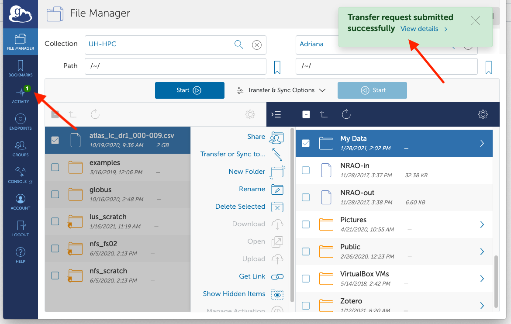

Confirm Transfer Completion
- On the Activity page, click the arrow icon on the right to view details about the transfer. You will also receive an email with the transfer details.

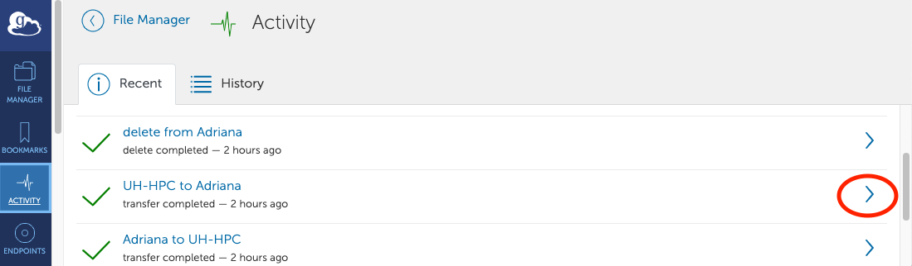

---

# Activity Page

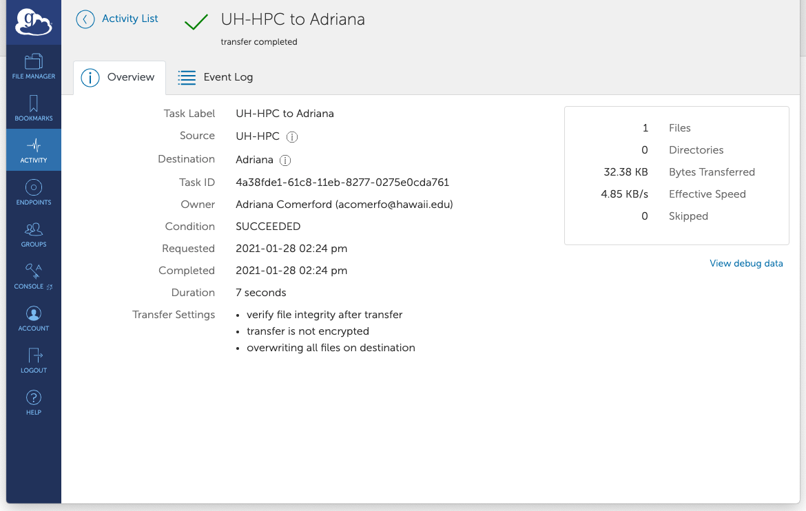

If you notice that the transferred files are not listed in the right panel with your Globus Connect Personal collection. Click the refresh icon (circular arrows) at the top of the collection panel to see the updated contents.

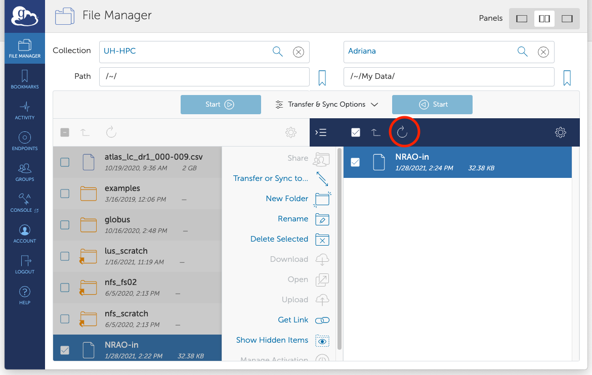

---

# Questions about Globus

__?__


