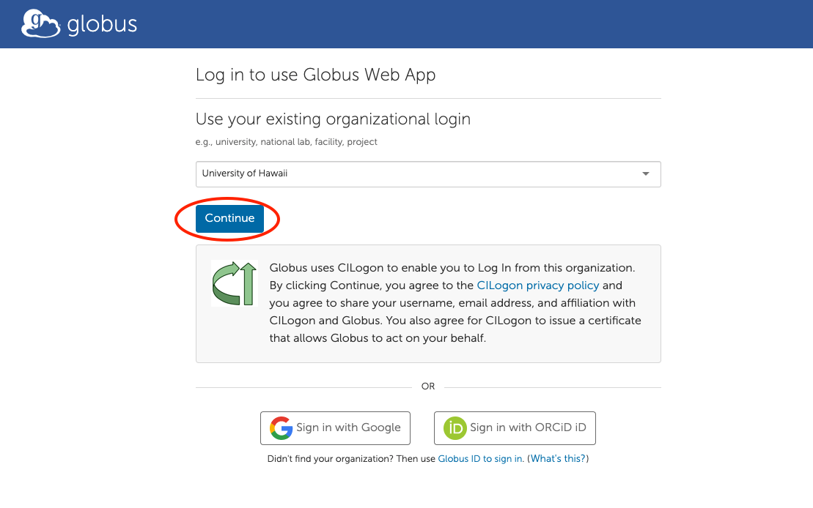
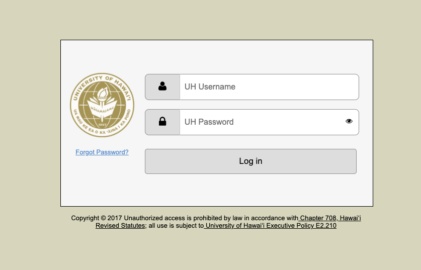
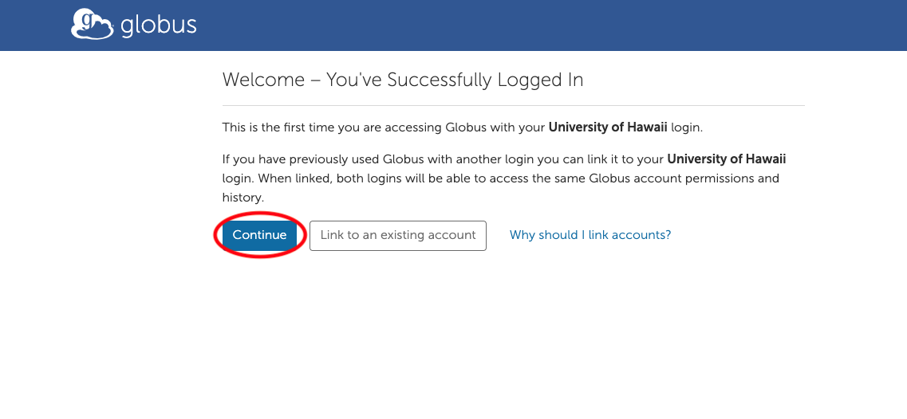
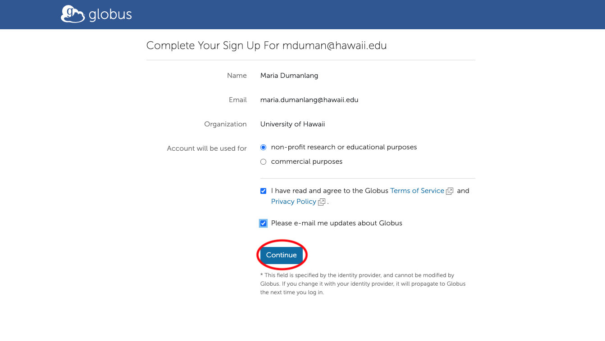
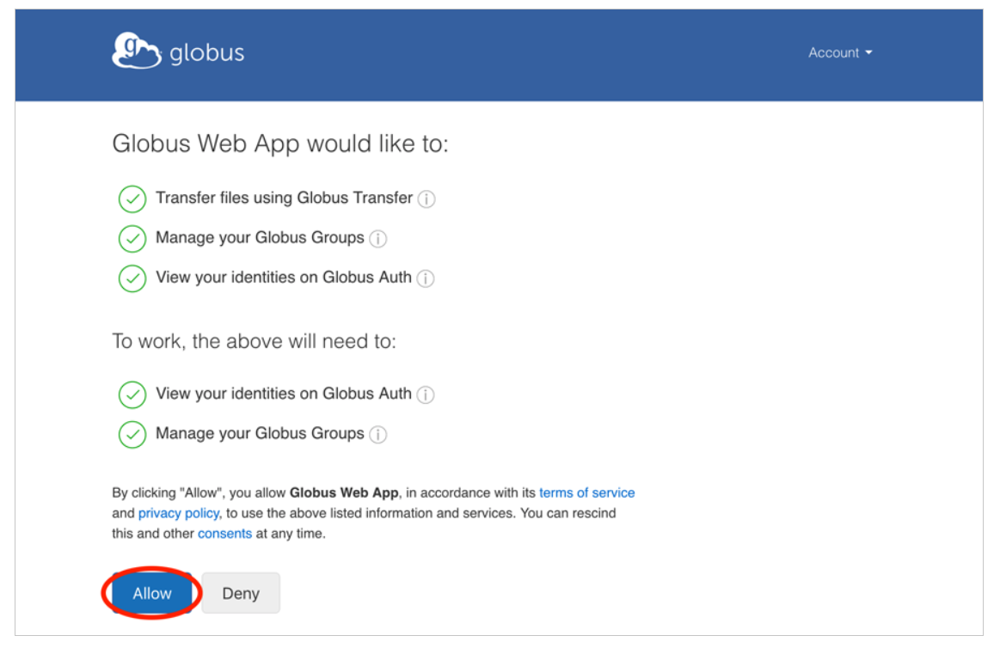

### Transfering Files with Globus

Visit www.globus.org and click "Login" at the top of the page. On the Globus login page, type in University of Hawaii. When you find it, click Continue.

# *Please Note
- UH does not provide a Globus subscription for external collaborators 
- Default settings may not include data sharing

---

# You’ll be redirected to your UH login page. Use your UH credentials to login.

- Some organizations will ask for your permission to release your account information to Globus. Once you’ve logged in with your UH credentials, Globus will ask if you’d like to link to an existing account. If this is your first time logging in to Globus, click "Continue." If you’ve already used another account with Globus, you can choose "Link to an existing account."
---

---
# You may be prompted to provide additional information such as your organization and whether or not Globus will be used for commercial purposes. Click on non-profit research or educational purposes. Complete the form and click "Continue."

# Finally, you need to give Globus permission to use your identity to access information and perform actions (like file transfers) on your behalf.

# Globus Connect Personal

Globus Connect Personal turns your laptop or other personal computer into a Globus endpoint with just a few clicks\. With Globus Connect Personal you can share and transfer files to/from a local machine—campus server\, desktop computer or laptop—even if it's behind a firewall and you don't have administrator privileges\.

Globus Connect Personal puts the power of Globus on your computer\.

Dramatically increases data transfer speeds over scp and other transfer tools\.

Automatically suspends transfers when computer sleeps and resumes when turned on\.

Installs in seconds using native operating system install packages\.

Works with firewalls that block incoming connections\, and behind most NATs\.

Uses proven Globus infrastructure for security and authentication\.

# Installation Instructions

__Installing Globus Connect Personal__

_[Globus Connect Personal for Mac](https://docs.globus.org/how-to/globus-connect-personal-mac)_  __for Mac OS X 10\.7 or higher \(Intel only\)__

_[Globus Connect Personal for Linux](https://docs.globus.org/how-to/globus-connect-personal-linux)_  __for common x86\-based distributions__

_[Globus Connect Personal for Windows](https://docs.globus.org/how-to/globus-connect-personal-windows)_  __for recent Windows versions__

__Note: Once you are done installing GCP\, the Globus Connect Personal agent will be running in the background\. Once you disconnect from it\, you can__  __launch__  __the application again by__  __clicking__  __“command\+space bar” keys on Mac machine or Windows key on Windows machine and typing “globus” to select the application to restart it\.__
