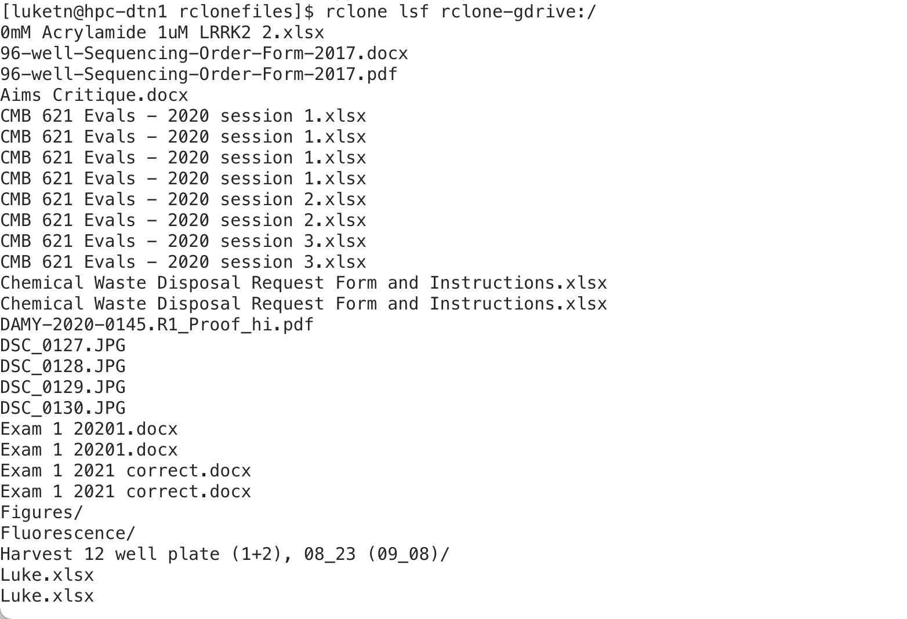
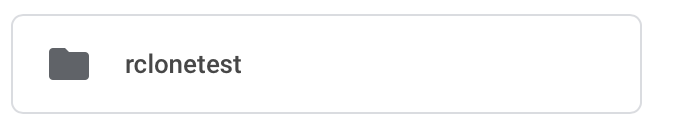
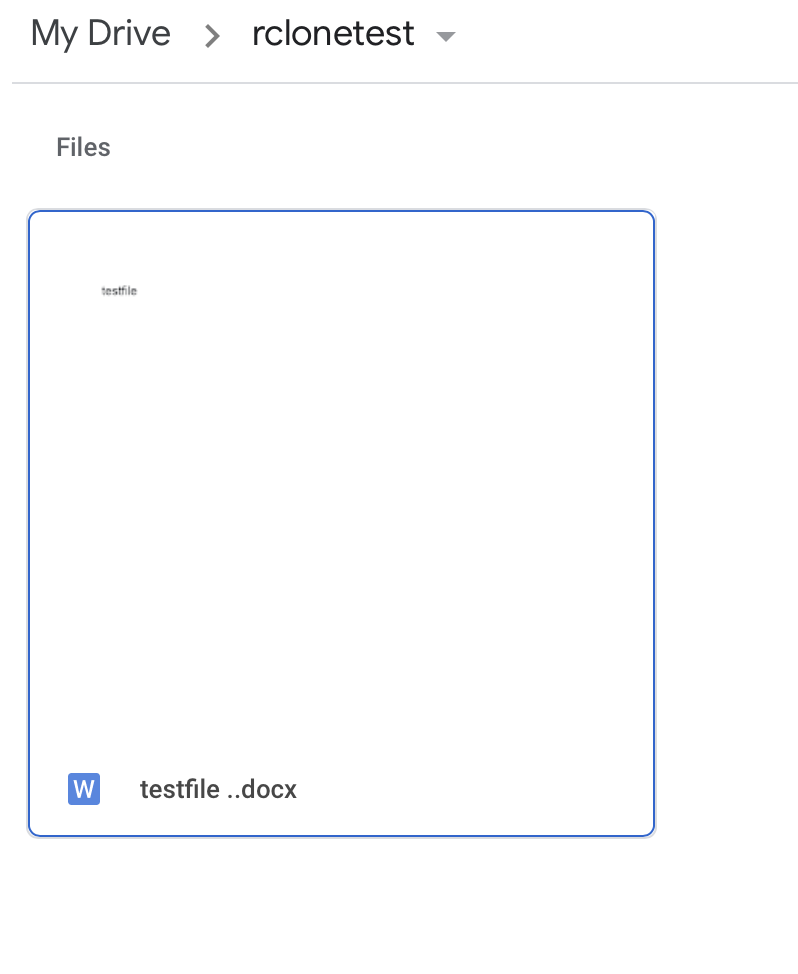
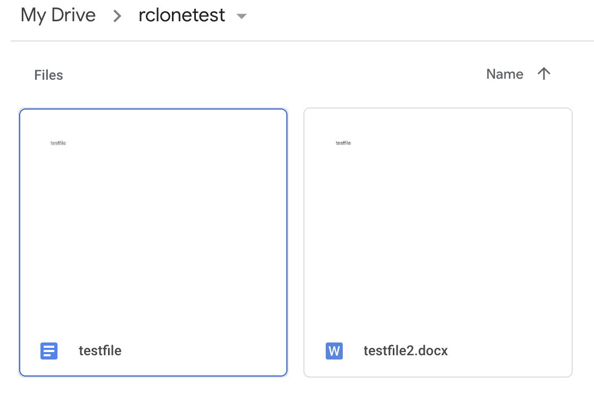

# Now we can list files from GDrive
- ‘lsf’ is how we list files using Rclone

~~~
$ rclone lsf rclone-gdrive:/
~~~
{: .language-bash}

---

# Now we can create a directory to transfer files to/from MANA/GDrive
- Make a directory called “rclonefiles” using the “mkdir” command

~~~
$ mkdir rclonefiles
~~~
{: .language-bash}

- Move into the directory we just created

~~~
$ cd rclonefiles
~~~
{: .language-bash}

- ‘cd’ is the change directory command

---

# Create a test document for transfer

In google drive create a folder name it “rclonetest” 

Within that folder create a new doc and call it “testfile”

---

# Copying the directory contents from GDrive to Mana

‘rclone copy’ has a source and destination required

GDrive being the source in the example below and the current directory (represented by the ‘.’) the destination

~~~
$ rclone copy rclone-gdrive:/rclonetest .
~~~
{: .language-bash}

This will copy the folder contents to the current directory - Note the ‘.’ at the end this is represents the current directory as the destination folder - we could also have used ~/rclonefiles or /home/username/rclonefiles as that same folder path.

---

# MANA to GDrive

- Create a testfile2.docx on the Mana DTN by copying testfile.docx

~~~
$ cp testfile.docx testfile2.docx
~~~
{: .language-bash}

‘cp’ is the copy command in the terminal/shell

~~~
$ ls
~~~
{: .language-bash}

---

# Now copy testfile2.docx to GDrive 
The source is the Mana testfile2.docx and the destination is gdrive

~~~
$ rclone copy testfile2.docx rclone-gdrive:/rclonetest
~~~
{: .language-bash}

---

You can check GDrive and the file should appear!

---

The copy command on a folder will overwrite files that have the same name but if a files exists on the destination that isn’t in the folder being copied it will be retained on the destination (when we get to sync you will see a difference in this behavior)

The sync command is useful to keep a folder on GDrive and somewhere else with identical contents - meaning that if the destination folder has files that do not exist on the source they will be removed (so be careful)

---

# Rclone sync source destination

Let's remove testfile.docx and sync our rclonefiles folder to our GDrive rclonetest folder

~~~
$ rm testfile.docx
~~~
{: .language-bash}

~~~
$ rclone sync ~/rclonefiles rclone-gdrive:/rclonetest
~~~
{: .language-bash}

We should see in GDrive that now only testfile2.docx is there because the folders are in sync - Mana’s rclonefiles folder was the source so the GDrive rclonetest folder is now identical to rclonefiles

RClone large transfer - use nohup

For transfers that make take a long time that you do not wish to observe or that your connection might disconnect you should use ‘nohup’ so they run in the background until complete. Example of nohup ‘rclone copy’ below:

~~~
$ nohup rclone copy source destination > nohup.out &
~~~
{: .language-bash}

The ‘>’ after the destination will direct any standard output to be written to the nohup.out file and the ‘&’ on the end tells the shell to disconnect the command issued and run it in the background so you can still use your terminal/shell for other commands or exiting the session - the command issued with ‘nohup’ will continue to run.

---

# Rclone documentation

More information about Rclone and Google Drive can be found here:

https://rclone.org/drive/#limitations

You can download for your machine her https://rclone.org/downloads/

Note - there is an experimental GUI for your laptop/workstation https://rclone.org/gui/

### Questions?



